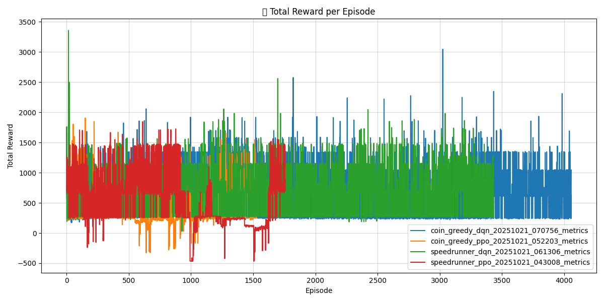

# RL Agents for Super Mario Bros & Breakout

Hey, thanks for checking out our project!  

This repository contains our implementation of reinforcement learning agents trained to play **Super Mario Bros** and **Breakout**.  

---

## Explanation Video
[Embed your explanation video here]

---
## RL Agents using Stable Baselines (Mario & Breakout)

This repository contains Reinforcement Learning (RL) experiments and agents for two benchmark environments: Super Mario Bros and Breakout. The codebase includes environment wrappers, training and evaluation scripts, configuration files, and saved logs/models produced during experiments.

Key goals:
- Implement and compare different RL algorithms (DQN, PPO and variants).
- Experiment with reward shaping / persona-driven rewards for Super Mario Bros.
- Provide reproducible configs, logs and scripts to train and evaluate agents.

## Repo layout (top-level)

- `Agents/` – agent abstractions and neural network code
- `Breakout/` – Breakout environment-specific code, configs and requirements
- `Mario/` – Super Mario Bros environment code, configs and requirements
- `envs/` – custom environment wrappers used by experiments
- `data/` – logs, training metrics, and saved CSVs
- `models/` – saved model checkpoints (may be large; typically not checked into git)
- `src/` – top-level training/eval utilities (also environment-specific `src/` inside Mario/)
- `train_all.sh` – convenience script to kick off multiple experiments
- `notebooks/visualize.ipynb` – visualization helpers and result plotting

## Prerequisites

- OS: Linux (WSL works), macOS, or Windows (with appropriate binaries)
- Python: 3.10 (repo contains .pyc files for 3.10; 3.9+ may also work)
- Recommended: virtual environment (venv / conda)

Environment-specific requirements are present in the subfolders. For example:

- `Breakout/requirements.tx` (environment-specific requirements)
- `Mario/requirements.tx`

If those files are missing or you prefer a minimal global set, install common packages used in the repo:

```bash
python -m venv .venv
source .venv/bin/activate
pip install --upgrade pip
pip install stable-baselines3 gym torch numpy opencv-python gym-super-mario-bros nes-py gym[atari]
```

Note: Exact dependencies / versions for experiments may be specified in the environment-specific requirement files—check them before training.

## Agent Demonstrations

Here are examples of our trained agents in action:

### Super Mario Bros Agents
<div align="center">

<table>
  <tr>
    <td align="center">
      🪙 <b>Coin Greedy (DQN)</b><br>
      
    </td>
    <td align="center">
      🪙 <b>Coin Greedy (PPO)</b><br>
      
    </td>
  </tr>
  <tr>
    <td align="center">
      ⚡ <b>Speedrunner (DQN)</b><br>
      
    </td>
    <td align="center">
      ⚡ <b>Speedrunner (PPO)</b><br>
      
    </td>
  </tr>
</table>

</div>


#### Collector Agent (Exploration Focus)
This agent tries to explore and collect items:
- PPO Implementation: [Watch Video](Mario/videos/collector_ppo_eval.mp4)

Each agent demonstrates different learned behaviors based on their reward shaping:
- Speedrunner: Focuses on forward progress and quick completion
- Coin Collector: Prioritizes coins and power-ups, sometimes backtracking to collect them
- Collector: Balances exploration with item collection

## Quickstart — Train & Evaluate

There are a few entry points depending on which environment you want to run.

1) Train Breakout using the top-level training script and the Breakout configs

```bash
# From repo root
python src/train.py --config Breakout/configs/BreskPoint/BreakPoint.yaml
```

2) Train Mario using the Mario-specific training script

```bash
# From repo root
python Mario/src/train.py --config Mario/configs/dqn_config.yaml --persona speedrunner
```

3) Run a bundle of experiments (if available)

```bash
./train_all.sh
```

4) Evaluate a trained model

```bash
python src/eval.py --model path/to/model.zip --env Breakout
# or for Mario (if using Mario's evaluation script)
python Mario/src/eval.py --model path/to/mario_model.zip
```

These commands are examples; see the individual `train.py` and `eval.py` docstrings or help output (`-h`/`--help`) for exact CLI options.

## Configuration

Experiment configuration files live in the `configs/` subfolders. Examples:

- `Breakout/configs/BreskPoint/BreakPoint.yaml`
- `Mario/configs/dqn_config.yaml`

Each config typically controls: algorithm, learning rate, seed, training timesteps, env name, wrappers, and logging paths. Use configs to reproduce experiments.

## Logs, models and outputs

- Training logs (CSV, TensorBoard, or custom logs) are stored under `data/logs/` or environment-specific `data/` folders.
- Saved model checkpoints are stored under `models/` or in paths defined by the config files.
- Plots and visualizations are available or can be generated from `notebooks/visualize.ipynb`.

## Notes on experiments

- Super Mario: the repo experiments include persona-style reward shaping (e.g., coin-focused, speed-focused). See the `Agents` code and `envs` wrappers for reward logic.
- Breakout: experiments compare PPO vs DQN variants in Atari-style settings.

### Breakout Performance Analysis

#### Agent Gameplay Demo
[](https://www.youtube.com/watch?v=1F-17lLs6lU)
*Click the image above to watch our trained Breakout agent in action!*

#### Training Progress Visualization


*Single training run showing raw rewards (gray) and 300-episode rolling average (blue)*


*Combined PPO training runs showing episode rewards (light blue) and 20-episode average (red)*

#### PPO Agent Performance Analysis
- **Learning Progression**: The agent shows steady improvement over approximately 25,000 episodes
- **Starting Performance**: Near-zero rewards in early episodes
- **Final Performance**: Achieves stable average rewards of 10-15 points per episode
- **Variance**: High episode-to-episode variance throughout training, but stable moving average
- **Peak Performance**: Individual episodes can reach rewards of 25-30 points

#### Training Characteristics
- **High Variance**: Raw rewards show significant episode-to-episode fluctuation
- **Stable Learning**: 300-episode rolling averages show consistent upward trend
- **Long-term Stability**: Performance plateaus after initial learning phase
- **Exploration Pattern**: Maintains exploration while improving average performance

The visualizations were generated using the training logs in `Breakout/data/Breakout/logs/` and can be recreated using the Jupyter notebook at `Breakout/notebooks/visualize.ipynb`.

## Development & Contributing

If you'd like to extend or reproduce experiments:

1. Create a virtual environment and install dependencies.
2. Add a new config under the relevant `configs/` directory.
3. Run training with your config and save checkpoints to `models/`.
4. Open a PR with a short description and example config/ results.

Please follow the repo style and add tests or reproducible instructions for significant additions.

## Troubleshooting

- Missing packages: ensure your venv is activated and you installed the environment-specific requirements.
- GPU support: install a CUDA-enabled `torch` build and verify `torch.cuda.is_available()`.
- Long training times: use smaller `total_timesteps` in config for quick experiments.

## Contact / Authors

If you have questions, open an issue in this repository or contact the project owner.

## License

Include your license here (e.g., MIT). If no license is present, add one to clarify reuse permissions.

---

Summary of changes:
- Rewrote README to give a practical, reproducible guide for setting up, training and evaluating experiments.
